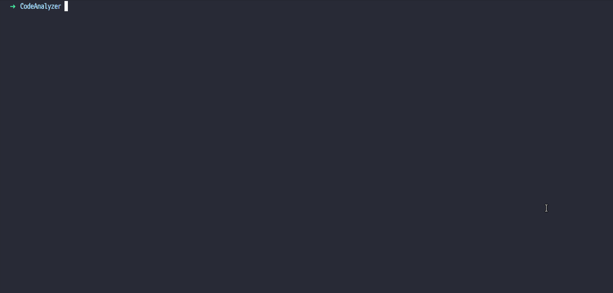

<h1 align="center">
  <br>
  <a href="https://github.com/smcommits/CodeAnalyzer/archive/develop.zip"></a>
</h1>

<h1 align="center">Ruby Code Analyzer</h1>

<p align="center">
    <a href="https://github.com/smcommits/CodeAnalyzer/issues">
    
     <a href="https://github.com/smcommits/CodeAnalyzer/pulls">
    
     <a href="./LICENSE">
      
</p>
      
<p align="center">
  <a href="#about">About</a> •
  <a href="#prerequisites">Prerequisites</a> •
  <a href="#available-inspections">Available Inspections</a> •
  <a href="#getting-started">Getting Started</a> •
  <a href="#under-the-hood">Under The Hood</a> •
  <a href="#contributing">Contributing</a> •
  <a href="#authors">Authors</a> •
  <a href="#license">License</a>
</p>

---

## About
This repository contains a static code analyzer tool for Ruby source code. It inspects the code for styling and complexity errors. This tool aims to help enforce appropriate programming practices. 


## Prerequisites
To use the program _Parser_ and _Colorize_ gems must be installed on the local machine. 

To install parser gem, run the following command in the terminal emulator.
```
gem install parser
```

To install Colorize gem, run the following command in the terminal emulator.
```
gem install colorize
```


## Available Inspections

Please refer to [this documentation](./assets/docs/INSPECTION_DOC.md) to understand all the inspection features.


## Getting Started

### Step 1

To get started you have to clone the repo on your local machine. To clone the repo run the following command in a terminal emulator:
   
```
git clone https://github.com/smcommits/CodeAnalyzer
```
       
Alternatively, you can click [this link](https://github.com/smcommits/CodeAnalyzer/archive/develop.zip) to download the repo as a zip file.

### Step 2

Now navigate to the bin directory using the following command

```
cd bin
```

### Step 3

Run the linter by executing main.rb file using the followed by the path to your file. You can also run -h to get help.

```
./main.rb path/to/your/file
```

Example:

```
./main.rb ~/code/my_ruby_code.rb
```

After executing, the tool will inspect for any errors and display the error location, type, and message.




## Under the hood
This project uses Abstract Syntax Tree and Lexical Analysis to analyze the code for errors. Parser gem is used to implement the solutions requiring AST, and ruby Ripper library is used to implement the solutions that require lexical analysis.

## Authors

👤 **Anas Siddiqui**

- GitHub: [Anas Siddiqui](https://github.com/smcommits)


## 🤝Contributing

Contributions, issues, and feature requests are welcome!

## Show your support

Give a ⭐️ if you like this project!

## Acknowledgments

### Colorize Gem
  To add colors to the user interface.
  
### Inspection Logo
   <div>Icons made by <a href="https://creativemarket.com/eucalyp" title="Eucalyp">Eucalyp</a> from <a href="https://www.flaticon.com/" title="Flaticon">www.flaticon.com</a></div>
   
 ## Disclaimer
This project is still very new and will not produce completely accurate results. Therefore, it should not be your primary source of linting. If you are looking for a Ruby source code linter, then use [Rubocop](https://github.com/rubocop-hq/rubocop)
   
## License

This project is [MIT](./LICENSE) licensed.


